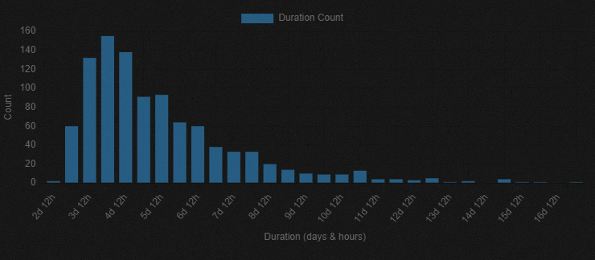

# Garden Gnome - Cookie Clicker Garden Automator

## Overview

Garden Gnome is a mod for [Cookie Clicker](https://orteil.dashnet.org/cookieclicker/) designed to automate the Garden minigame. Its primary purpose is to strategically plant and harvest crops to unlock all garden seeds and associated upgrades as efficiently as possible, using defined mutation layouts and priorities.

Think of it as a tiny, tireless gnome tending your virtual plants so you don't have to!

It runs automatically after each garden tick, making decisions about which soil to use, what to plant, and when to harvest. There is no UI integration – the gnome works silently in the background. See **Current Gaps & Limitations** for more details on what it _doesn't_ do.

It works on all Garden Levels, and given enough time (and a bit of luck!), it can unlock the full seed log starting from Garden Level 3, when the layouts for Juicy Queenbeet and Everdaisy become viable.

## Key Features

- **Automated Targeting:** Intelligently identifies the next seed or upgrade to target based on viable options and predefined priorities.
- **Strategic Planting:** Uses specific garden layouts optimized for various single-parent and multi-parent mutations, following the wiki's [Mutation Setups](https://cookieclicker.fandom.com/wiki/Garden#Mutation_Setups). Layouts dynamically adjust to your current garden level.
- **Synchronized Growth:** Synchronizes planting times so parent plants mature together, maximizing those tricky mutation chances. This includes:
  - Synchronizing two-parent setups even when they have different growth times.
  - Skipping synchronization for "rolling" strategies (like attempting Crumbspore, Brown Mold, or upgrade drops).
- **Frenzy-Aware Planting:** Holds off on planting during CPS buffs (Frenzies, Building Specials, etc.) to avoid wasting cookies when costs are inflated.
- **Smart Harvesting & Pruning:** The gnome is quite tidy:
  - Harvests mature plants when they're the target for a garden upgrade drop.
  - Harvests Queenbeets and Bakeberries just a tick before they decay to maximize cookie/lump yields at harvest.
  - If Crumbspore or Brown Mold aren't unlocked yet, it lets Meddleweed live to one tick beforedecay to boost the chance of getting those spores.
  - Automatically weeds out incorrectly planted crops or plants sitting where they shouldn't be according to the current strategy.
  - Keeps only the _single oldest_ instance of each _locked_ species growing, freeing up precious garden space while waiting for that elusive unlock.
  - Clears and restarts a mutation attempt if plants decay and the remaining arrangement can no longer achieve the target mutation (currently works _only_ for one-parent mutations).
    - For example, in a Juicy Queenbeet attempt, if there are no longer any enclosed "rings" around an empty tile, the remaining Queenbeets will be cleared, and the attempt restarted.
    - It considers all possible mutations for still-locked seeds. In an exception to the same Juicy Queenbeet attempt, if Shriekbulb or Duketater are still locked, it won't clear the plot until it couldn't achieve those mutations either.
- **Soil Optimization:** Automatically switches between Fertilizer (for faster growth) and Wood Chips (for better mutation odds) depending on whether plants are still growing or mature and waiting for mutations.
- **Auto Sacrafice:** Sacrafices garden after all seeds and upgrades are unlocked for 10 sugar lumps, and continues the cycle again.

## Unlock Performance

Curious how fast this little gnome actually works? I built the [Garden Gnome Runner](https://github.com/bdunks/garden-gnome-runner), a tool that simulates the garden minigame ticks in a loop as fast as possible (no actual cookie clicks involved!). I've run thousands of simulations from garden reset to full seed log unlock, equating to hundreds of simulated years.

Here are some stats based on a 1,000-run sample size on a Level 9+ plot (6x6), representing about 16 simulated years:

| Statistic  | Time to Unlock |
| :--------- | :------------- |
| **Mean**   | 5 days, 17 hrs |
| **Median** | 5 days, 1 hr   |
| **Min**    | 2 days, 23 hrs |
| **Max**    | 17 days, 5 hrs |

|  |
| :----------------------------------------------------------------------------------------------: |
|                                   _Histogram of 1000 runtimes_                                   |

The runtime variability depends heavily on the luck involved in unlocking the Juicy Queenbeet.

The Wiki's strategy for [Grinding Sugar Lumps](https://cookieclicker.fandom.com/wiki/Garden#Grinding_Sugar_lumps) suggests it _can_ be done in around 5.5 hours. It also proposes more advanced techniques like "plot splitting" (i.e., attempting two mutations at once on larger plots).

Given that this mod's average performance is roughly teh same as that ballpark figure, and implementing those advanced strategies would add significant complexity (and potential bugs!), I've decided to only ever attempt on mutation at a time.

**Smaller Gardens:** A Level 3 (3x3) Garden with only Fertilizer (<300 Farm buildings) can take 3-6 weeks to unlock all seeds, sometimes longer in very unlucky Juicy Queenbeet mutation outcomes. With Woodchips unlocked, you can consistently unlock all seeds in 2-3 weeks. This is an academic exercise, because during that time you could have upgraded your farm level several times from the daily sugar lump drops.

## Current Gaps & Limitations

- **No Bells and Whistles (UI/Config):** There's no UI integration – no alerts, no configuration options. This was built for personal use, and adding UI isn't planned. What you see (or rather, don't see) is what you get!
- **Two-Parent Mutation Restart:** For two-parent mutations, the mod waits for the whole setup to decay before restarting. It doesn't check each tick if a mutation is still possible (especially tricky logic when syncing plants with different timers). This smarter check _is_ implemented for single-parent mutations (it implemented to speed up Juicy Queenbeet attempts).
- **Amnesia on Refresh:** The mod remembers its current target plant/upgrade to avoid losing progress on an attempt if a new plant is unlocked, but this memory is wiped clean if you refresh the game page, and a different attempt may be started.
- **Bankrupcy:** If you don't have enough cookies in the bank, this mod will continue to attempt to plant, and will plant incomplete layouts. There are several provisions in place not to _waste_ cookies, however, we don't pause based on cookie inventory. Just turn off the mod!

## How to Run

### Bookmarklet (Easiest!)

Copy this code and save it as a bookmark. Paste it in the URL section. To activate, click the bookmark when the game's open.

```javascript
javascript: (function () {
  Game.LoadMod("https://bdunks.github.io/garden-gnome/gardenGnome.js");
})();
```

### Userscript (Set and Forget)

If you prefer the mod to load automatically every time you open Cookie Clicker, you can use a [userscript](https://en.wikipedia.org/wiki/Userscript) manager (like Tampermonkey or Greasemonkey). Install the `gardenGnome.user.js` file from this repository. An easy way is often to navigate to the file in the GitHub file list, click the "Raw" button, and your userscript manager should offer to install it.

## Cheat Discussion

Is this a cheat mod? That's in the eye of the beholder. This mod respects all constraints of the game (e.g., cookie costs, soil switch timeouts, etc.). I could classify it as an advanced auto clicker, or like hiring an little gnome that tends to my garden 24x7.

I made this for fun, and felt like sharing in case anyone else would enjoy it.

## Status & Contributions

This mod is provided **as-is**. It's been tested extensively using the [Garden Gnome Runner Tool](https://github.com/bdunks/garden-gnome-runner/), as well in the real game over many months before initial release.

Garden Gnome is considered **feature complete** for its main goal: unlocking seeds and upgrades.

- **Pull Requests:** Found a bug or have a neat optimization? Well-documented PRs _might_ be reviewed and accepted, time permitting.
- **Feature Requests:** New feature ideas are unlikely to be implemented unless they come with a pull request.
- **Bug Reports:** Feel free to report bugs, but please remember this is a hobby project. Responses and fixes might take a while (or might not happen, let's be honest!).

## Acknowledgements

A huge thank you to the [**CookieMonsterTeam**](https://github.com/CookieMonsterTeam/CookieMonster)! Their work provided a nice project structure template, and sound logic for to run on each garden tick. And, of course, they've made and maintain a fantastic mod!
